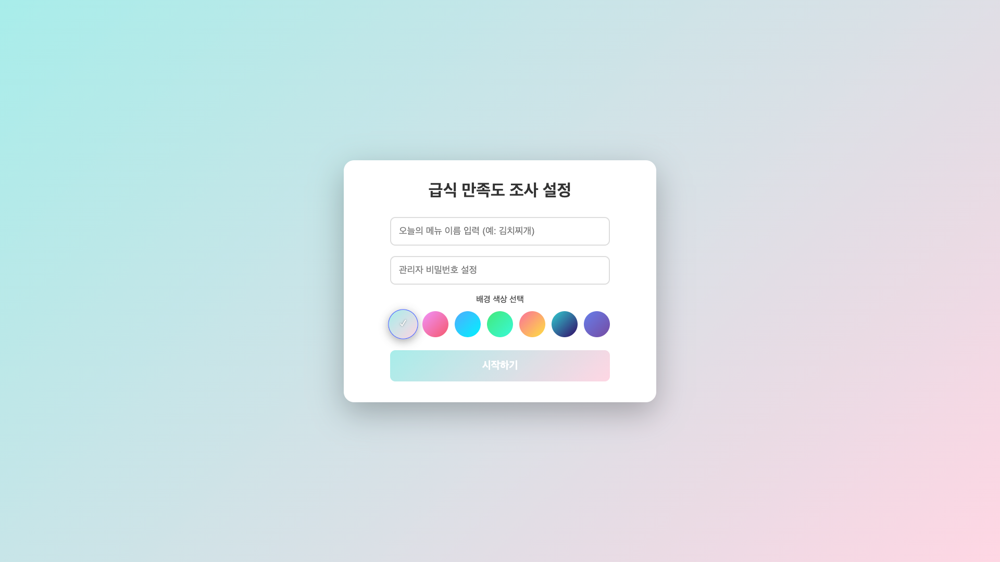
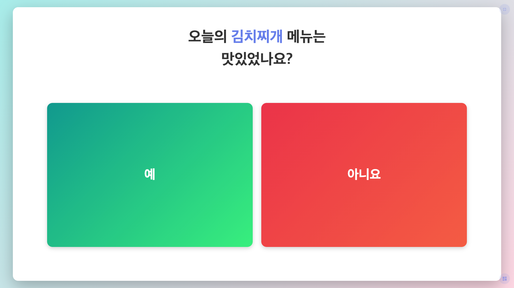
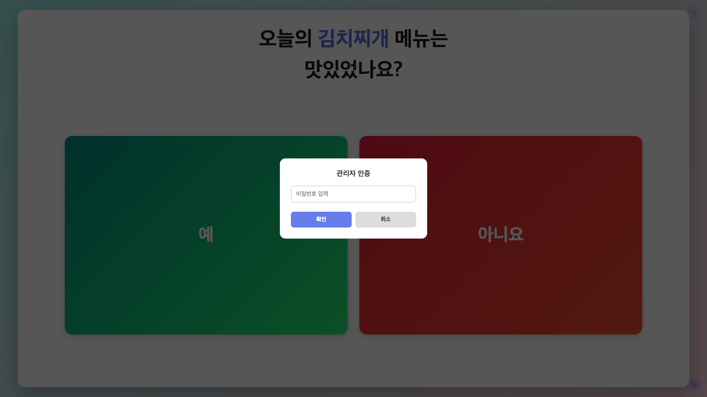
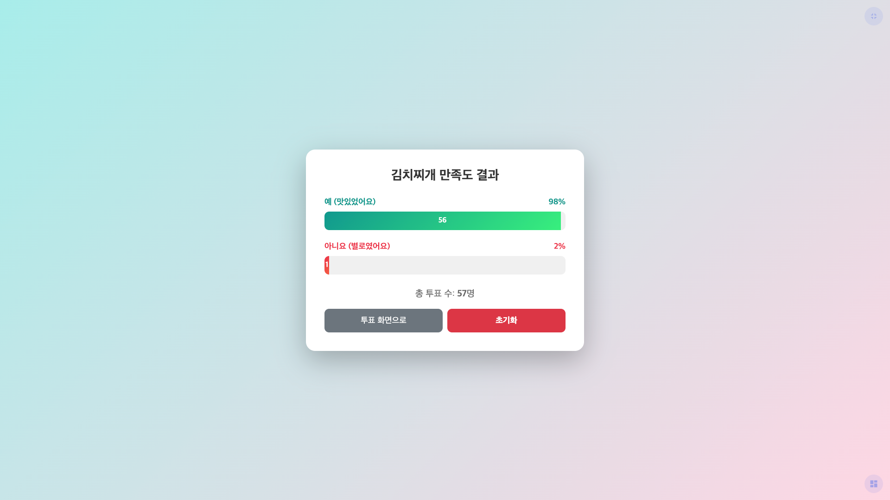

# 급식 만족도 조사 프로그램

## 프로젝트 개요

조OO 영양교사가 학생들의 급식 만족도를 실시간으로 확인하기 위해 기획된 프로젝트입니다.

매일 제공되는 급식의 주메뉴에 대해 학생들이 직접 평가할 수 있도록 하여, 영양교사가 학생들의 식사 만족도를 파악하고 향후 메뉴 개선에 반영할 수 있도록 돕습니다. 태블릿이나 컴퓨터를 급식실 입구에 설치하여 학생들이 식사 후 간편하게 투표할 수 있으며, 하루가 끝나면 결과를 확인하여 해당 메뉴에 대한 학생들의 반응을 한눈에 파악할 수 있습니다.

## 주요 기능

### 1. 초기 설정
- 오늘의 메뉴 이름 입력 (예: 김치찌개, 돈까스 등)
- 관리자 비밀번호 설정 (결과 확인 시 필요)
- 배경 색상 선택 (7가지 그라데이션 테마 제공)

### 2. 투표 화면
- 간단한 "예/아니요" 투표 방식
- 큰 버튼으로 터치 기기에 최적화
- 화면 비율에 따라 자동 레이아웃 조정 (가로/세로 모드)
- 전체화면 모드 지원 (우측상단 버튼)

### 3. 결과 확인
- 우측 하단 아이콘 클릭하여 접근
- 비밀번호 인증 후 결과 조회
- 막대 그래프로 시각화된 결과
- 투표 수와 비율 표시

### 4. 데이터 관리
- 브라우저 로컬 스토리지에 자동 저장
- 페이지를 새로고침해도 데이터 유지
- 초기화 버튼으로 새로운 조사 시작 가능

## 화면 구성

### 1. 초기 설정 화면

- 오늘의 메뉴 이름 입력
- 관리자 비밀번호 설정
- 7가지 배경 색상 테마 선택 (선택한 색상은 배경과 버튼에 모두 적용)
- 시작하기 버튼으로 투표 화면 진입

### 2. 투표 화면

- 설정한 메뉴 이름 표시
- 큰 "예/아니요" 버튼으로 간편한 투표
- 화면 비율에 따라 자동으로 버튼 배치 조정 (가로/세로)
- 우측상단: 전체화면 확장/축소 버튼
- 우측하단: 결과 확인 버튼 (비밀번호 필요)

### 3. 비밀번호 입력 화면

- 결과 확인을 위한 관리자 인증
- 초기 설정 시 입력한 비밀번호 또는 히든 비밀번호(`whxogks`) 사용

### 4. 결과 화면

- 메뉴별 투표 결과를 막대 그래프로 시각화
- "예/아니요" 각각의 투표 수와 비율 표시
- 총 투표 수 확인
- 투표 화면으로 돌아가기 버튼
- 초기화 버튼으로 모든 데이터 리셋

## 사용 방법

### 시작하기

1. **웹 브라우저로 실행**
   - `index.html` 파일을 더블클릭하여 브라우저에서 실행

2. **온라인으로 사용** (선택사항)
   - GitHub Pages 등을 통해 온라인 배포
   - 웹 주소로 접속하여 어디서나 사용 가능

### 일일 운영 방법

#### 아침 준비
1. 프로그램 실행 (또는 웹 주소 접속)
2. 오늘의 메뉴 이름 입력 (예: "불고기 덮밥")
3. 관리자 비밀번호 설정
4. 원하는 배경 색상 선택
5. "시작하기" 버튼 클릭
6. 우측상단 버튼을 눌러 전체화면 모드로 전환

#### 점심시간 (투표 진행)
- 학생들이 급식 후 "예" 또는 "아니요" 버튼 클릭
- 터치 한 번으로 투표 완료
- 투표 내역은 자동 저장

#### 결과 확인
1. 우측 하단 결과보기 아이콘 클릭
2. 설정한 비밀번호 입력
3. 투표 결과 확인 (막대 그래프, 비율, 총 투표 수)
4. "투표 화면으로" 버튼으로 다시 투표 화면 복귀

#### 다음 날 준비
- 결과 화면에서 "초기화" 버튼 클릭
- 새로운 메뉴로 다시 설정

## 권장 사용 환경

- **기기**: 태블릿, 터치스크린 모니터, 일반 PC
- **브라우저**: Chrome, Edge, Safari, Firefox (최신 버전 권장)
- **설치 위치**: 급식실 입구 또는 배식대 근처

## 참고사항

- 데이터는 브라우저의 로컬 스토리지에 저장되어 페이지를 새로고침해도 유지됩니다
- 브라우저 데이터를 삭제하거나 다른 기기에서 접속하면 데이터가 초기화됩니다
- 장기간 데이터 보관이 필요한 경우, 결과 화면을 캡처하여 별도 저장하는 것을 권장합니다
- 히든 비밀번호: `whxogks` (관리자 비밀번호를 잊어버렸을 때 사용)
